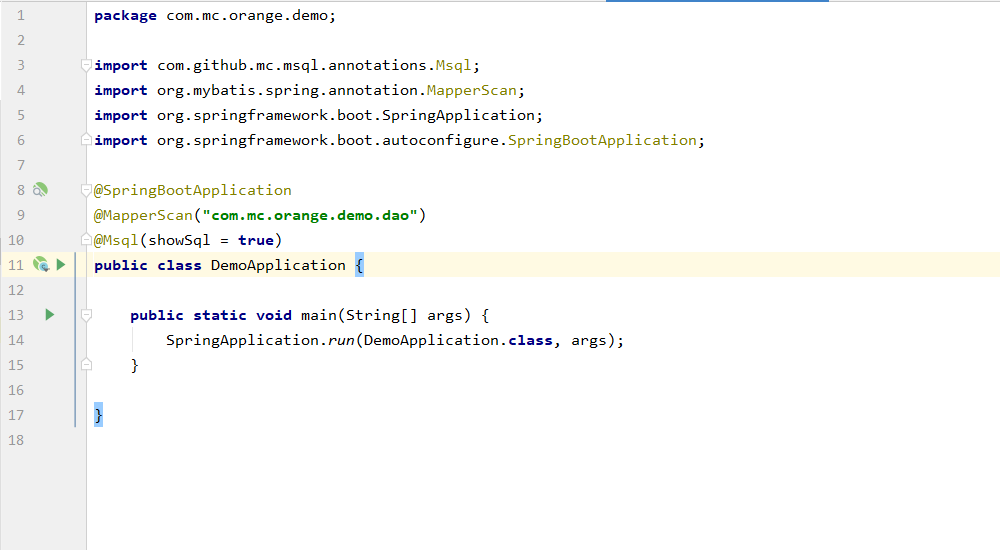
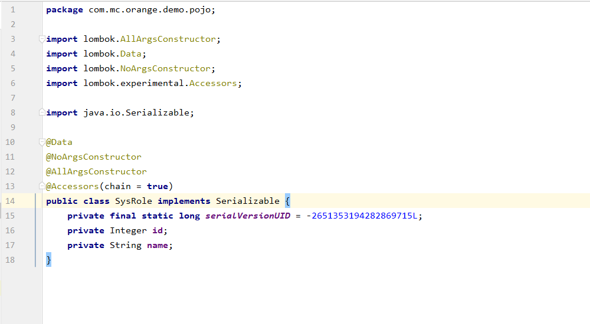

***

## **msql introduction:**

    msql is a syntax extension based on the mybatis framework. It focuses on solving hard sql, reducing the complexity of the mapper.xml file and its development and maintenance costs.
    Compared with the different usage syntax of other ORM frameworks, the use of msql is more concise. The core idea of msql is: template data + interface specification = sql.
    You can get a clear understanding of the "Template Data + Interface Specification = sql" formula with the following introductory tutorial.

### **Import:**
        <dependency>
            <groupId>com.github.guu-mc</groupId>
            <artifactId>msql</artifactId>
            <version>1.3</version>
         </dependency>

### **Instructions:**

  * Add msql annotations to the startup class of the MapperScan annotation to enable msql.
  * Example:
    

### MInsert:
  * value() default {Case.UNDER_SCORE_CASE(The naming style of the table field is named by default underline), Case.UNDER_SCORE_CASE(The naming style of the table name is named by default underline)}
  * pojo() default Object.class(Template object bytecode - if the first parameter of the interface is not a template object, you need to manually assign)
  * Example:
    

    
  * The above example result mapper statement is: insert into `sys_role`(`id`,`name`)values(#{id},#{name})

### MUpdate:
  * value() default {Case.UNDER_SCORE_CASE(The naming style of the table field is named by default underline), Case.UNDER_SCORE_CASE(The naming style of the table name is named by default underline)}
  * pojo() default Object.class(Template object bytecode - if the first parameter of the interface is not a template object, you need to manually assign)
  * Example:
    

    
  * The above example result mapper statement is: update `sys_role` set `name`=#{name} where `id`=#{id}
  * Precautions: MUpdate is modified according to the primary key. Here jump to the primary key definition. If there is no primary key "id" in the second interface definition of the example, an empty mapper statement will be generated.

### MDelete:

  * value() default {Case.UNDER_SCORE_CASE(The naming style of the table field is named by default underline), Case.UNDER_SCORE_CASE(The naming style of the table name is named by default underline)}
  * pojo() default Object.class(Template object bytecode - if the first parameter of the interface is not a template object, you need to manually assign)
  * Example:
    

    
  * The above example result mapper statement is: delete from `sys_role` where `id`=#{id} and `name`=#{name}
  * Precautions: MDelete's result mapper statement is based on all parameters or all template object properties, to generate delete conditions.

### MSelect:

  * value() default {Case.UNDER_SCORE_CASE(The naming style of the table field is named by default underline), Case.UNDER_SCORE_CASE(The naming style of the table name is named by default underline)}
  * <label style="color:red">pojo() default Object.class(Template object bytecode - If the return parameter is a template object or a List<template object>, the parsing return parameter is a template object, otherwise the first parameter of the interface is not a template object, then manual assignment is required.)</label>

# Subsequent supplement..
