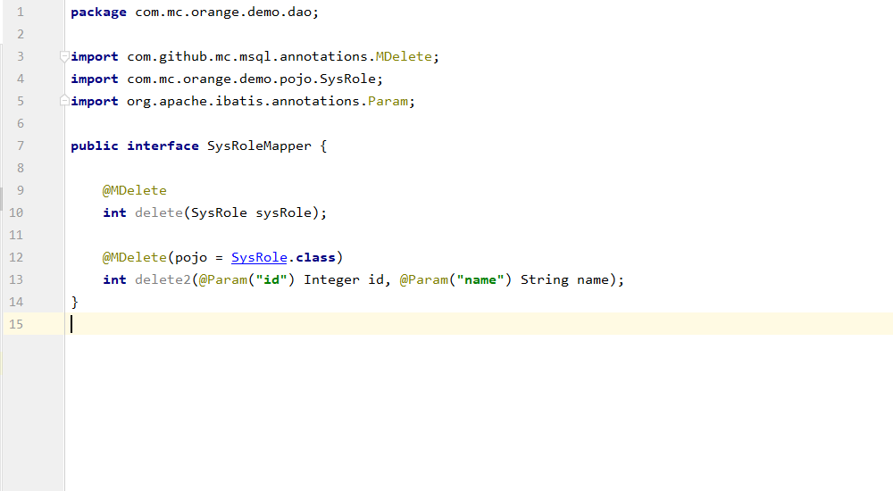

***

## **msql简介:**

    msql是基于mybatis框架的语法扩展.专注于解决硬性sql,减少mapper.xml文件复杂度及其开发和维护成本.
    以其他的ORM框架不同的使用语法相比,msql的使用方式更加简洁.msql的核心思想是: 模板数据+接口规范=sql.
    通过下面的入门教程您可以清楚地了解 "模板数据+接口规范=sql" 公式.

## **使用:**

  * 在配置MapperScan注解的启动类中添加Msql注解即可启用msql.
  * 示例:
    

### MInsert:
  * value() default {Case.UNDER_SCORE_CASE(表字段的命名风格 默认下划线命名), Case.UNDER_SCORE_CASE(表名的命名风格 默认下划线命名)}
  * pojo() default Object.class(模板对象字节码 - 如果接口第一个参数不是模板对象,则需要手动赋值)
  * 示例:
    

    
  * 上述示例结果mapper语句都为: insert into `sys_role`(`id`,`name`)values(#{id},#{name})

### MUpdate:
  * value() default {Case.UNDER_SCORE_CASE(表字段的命名风格 默认下划线命名), Case.UNDER_SCORE_CASE(表名的命名风格 默认下划线命名)}
  * pojo() default Object.class(模板对象字节码 - 如果接口第一个参数不是模板对象,则需要手动赋值)
  * 示例:
    

    
  * 上述示例结果mapper语句都为: update `sys_role` set `name`=#{name} where `id`=#{id}
  * 注意: MUpdate是根据主键进行修改的.这里跳转到主键定义 如果示例第二个接口定义中没有主键"id",将会产生一条空的mapper语句

### MDelete:

  * value() default {Case.UNDER_SCORE_CASE(表字段的命名风格 默认下划线命名), Case.UNDER_SCORE_CASE(表名的命名风格 默认下划线命名)}
  * pojo() default Object.class(模板对象字节码 - 如果接口第一个参数不是模板对象,则需要手动赋值)
  * 示例:
    

    
  * 上述示例结果mapper语句都为:delete from `sys_role` where `id`=#{id} and `name`=#{name}
  * 注意: MDelete的结果mapper语句,是根据所有参数或所有模板对象属性,进行产生删除条件.

### MSelect:

  * value() default {Case.UNDER_SCORE_CASE(表字段的命名风格 默认下划线命名), Case.UNDER_SCORE_CASE(表名的命名风格 默认下划线命名)}
  * <label style="color:red">pojo() default Object.class(模板对象字节码 - 如果返回参数为模板对象或List<模板对象>,则解析返回参数为模板对象,否则接口第一个参数不是模板对象,则需要手动赋值)</label>

# 后续补充
